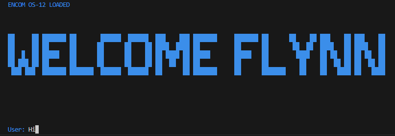

# How to Build a Retro AI Chat App with OpenAI API and Node.js | Step-by-Step Tutorial



### YouTube Tutorial:

https://youtu.be/pRqJld1Jgos

### Description:

In this tutorial we use OpenAI (ChatGPT) API and NodeJs to create a retro AI Chat console application. This is a easy beginner friendly tutorial. We start with a blank project and add the required dependencies and code the logic for a simple console application. As an added bonus we apply color and ascii art for a retro AI chat application.

I will also show you how to remove the following error:

```
DeprecationWarning: The `punycode` module is deprecated. Please use a userland alternative instead.
```

If you enjoy this tutorial please subscribe, like and share on YouTube.
