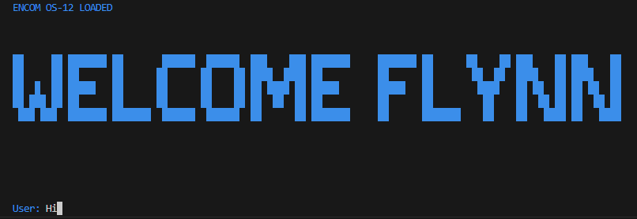
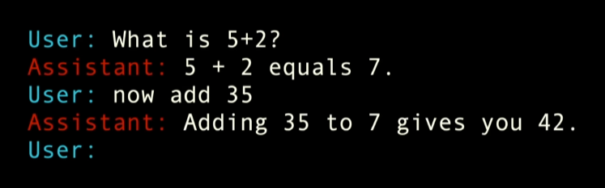

# Tron themed AI Chat App with an OpenAI API and Node.js 

# Description:

Using ChatGPT API and NodeJs to create an old-style chat application in the theme of Tron. Beginner tier react app. You will need an OPENAI Seceret Key for this app to run.
In the .env file, replace the blank space with your own API key. You'll also need a version of OPENAPI model GPT-4o for the API to return. 

## Setup Env
In a new terminal:
npm init -y 
npm install openai dotenv chalk readline-sync

## Run Env
node index.js
